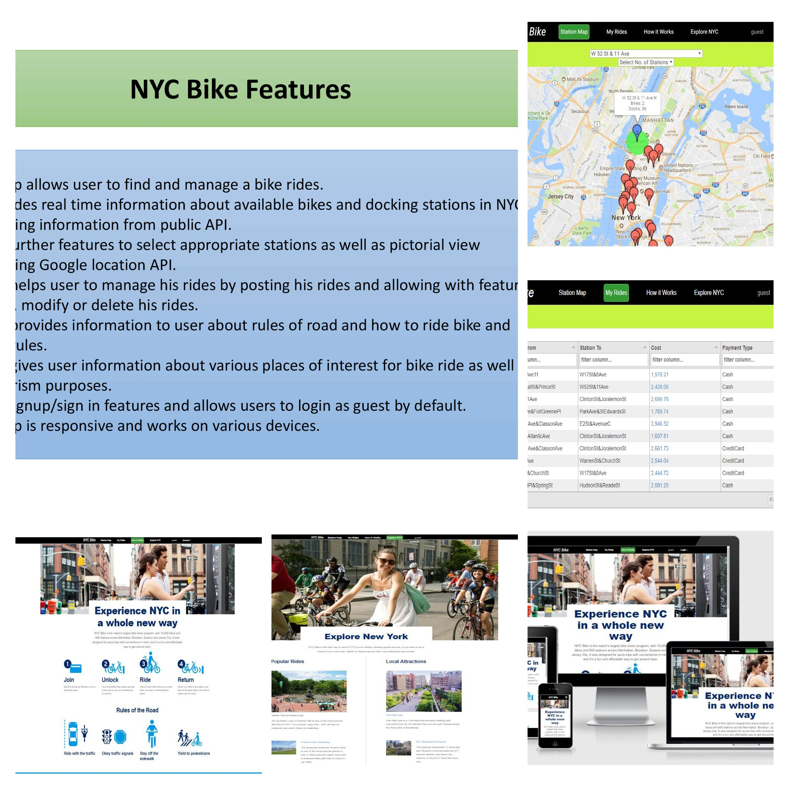
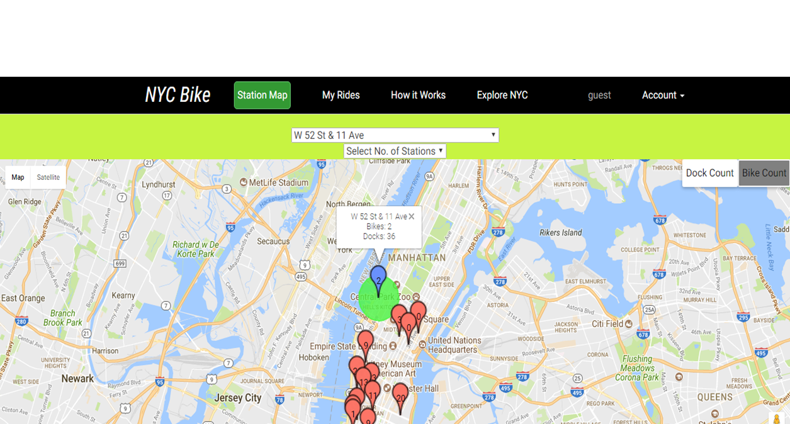
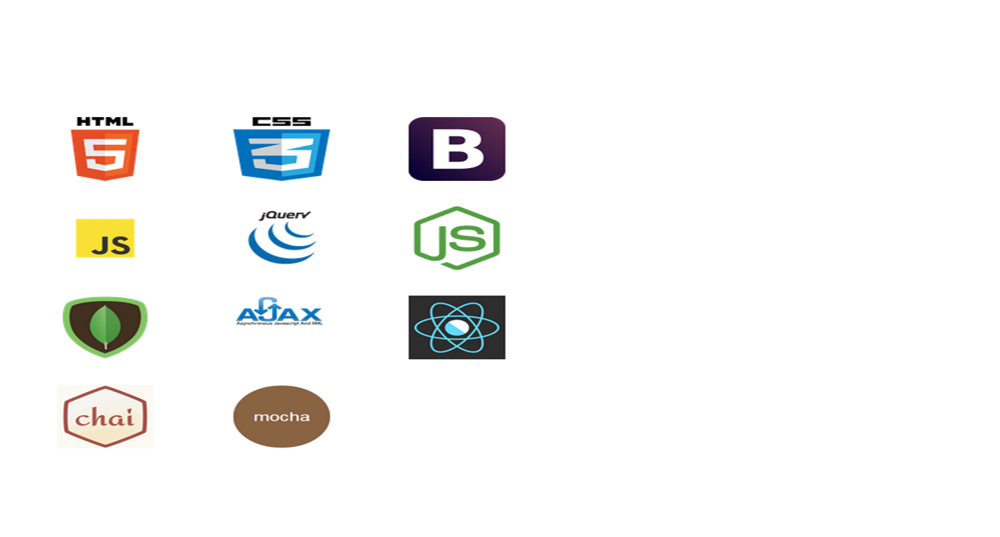

<h1>NYC CityBike</h1>

<p><a href="https://capstonenodenycitybike.herokuapp.com/">NYCCityBike</a> app allows user to find and manage a bike rides. </p>
<p>It provides real time information about available bikes and docking stations in NYC leveraging information from public API.</p>



## Features ##

Users can:

- Try a demo account (unique instances of pre-populated sample entries)
- Create unique user account with username and password; login/logout
- Get real time information about available bikes and docking stations in NYC leveraging information from public API.
- Select appropriate stations as well as pictorial view leveraging Google location API.
- Manage his rides by posting his rides and allowing with features to post, modify or delete his rides.
- Get information  about rules of road and how to ride bike and safety rules.
- Get information about various places of interest for bike ride as well as for tourism purposes.


## Getting started
### Installing
```
>   git clone https://github.com/surbhiguptasai/CapstoneNodeNYCityBike.git
>   cd CapstoneNodeNYCityBike
>   npm install
```
### Launching
```
>   npm start
```
Then open [`localhost:8000`](http://localhost:8080) in a browser.
### Testing
```
>   npm run test
```

<h2>Mockups</h2>
<p>Initial wireframes were created for each page. Mockups of all key processes were designed with user flow in mind.</p>



<h2>Technology</h2>
<ul>
  <li>HTML5</li>
  <li>CSS3</li>
  <li>Bootstrap</li>
  <li>JavaScript</li>
  <li>jQuery</li>
  <li>Ajax</li>
  <li>NodeJS</li>
  <li>MongoDB</li>
   <li>React</li>
  <li>Chai</li>
   <li>Mocha</li>
</ul>



## Users API ##

root path: /users

- '/login' 

	- GET for user to log in
		- required in req body:
			- { username: String, password: String }

- '/logout'

	- GET for user to sign out
		- destroys session, redirects to root

- '/sign-up'

	- POST to create new user account
		- required in req body:
			- { username: String, password: String }

- '/me'

	- GET to retrieve user data
		- protected, requires login/session cookie
		- returns:
			- { 
			- username: String,
			- firstName: String,
			- lastName: String,
			- rides: Array of objects:
				- { 
				- id: String,
				- rideDate: String,
				- stationFrom: String,
				- stationTo: String,
				- cost: String,
				- paymentType: String ,
				- bikeType: String
				- }
				
	- DELETE to delete user
		- protected, requires login/session cookie
		- redirects to root
				
- '/me/username'

	- PUT to edit username
		- protected, rquires login/session cookie
		- required in req body: {username: String}


- '/rides

	- POST for posting new entry
		- protected, requires login/session cookie
		- returns updated user data and new entry (see '/me' GET for format)

	- PUT for editing ride of User
		- protected, requires login/session cookie
		- required in req body: same fields at POST
		- returns updated user data (see '/me' GET for format)
	
	- DELETE for deleting ride of User
		- protected, requires login/session cookie
		- required in req body: {id: String}
		- returns updated user data (see '/me' GET for format)
		
	- GET for retrieving rides of user
        - protected, requires login/session cookie
        - required in req body: {id: String}
        - returns updated user data (see '/me' GET for format)

<h3>Responsive</h3>
<ul>
  <li>The app is fully responsive and quickly adapts to all mobile, tablet, and desktop viewports.</li>
</ul>


